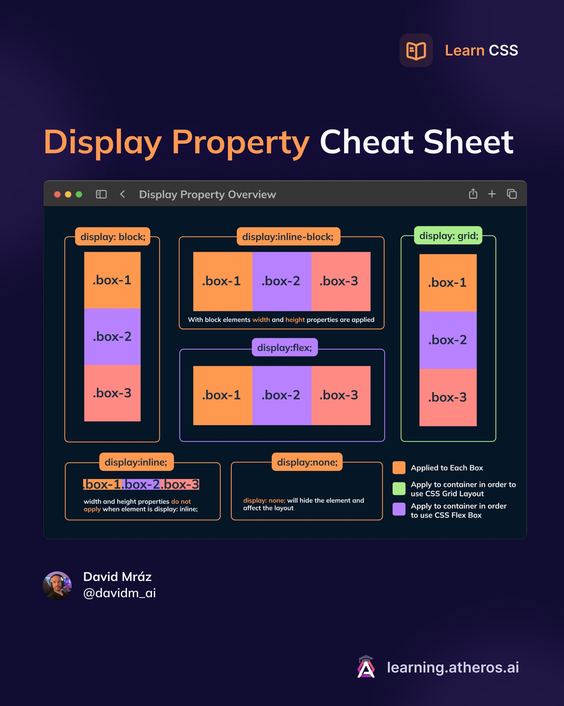
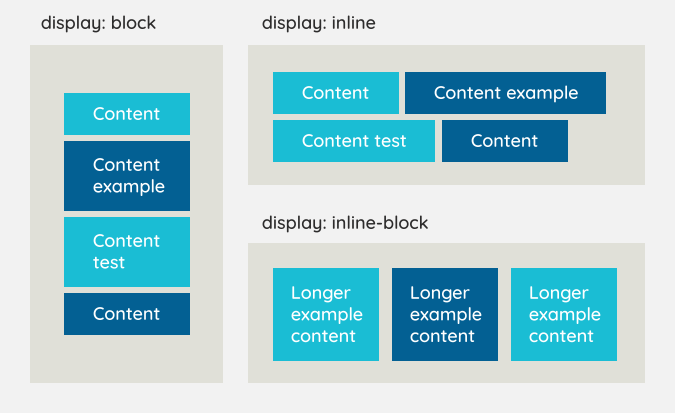

[](readme.md)






## Display
1. **Block (Elemento em Bloco)**:
   ```css
   .element {
       display: block;
   }
   ```
2. **Inline (Elemento em Linha)**:
   ```css
   .element {
       display: inline;
   }
   ```
3. **Inline-Block (Elemento em Linha com Comportamento de Bloco)**:
   ```css
   .element {
       display: inline-block;
   }
   ```
4. **Flex (Layout Flexível)**:
   ```css
   .container {
       display: flex;
       justify-content: space-between;
   }
   .item {
       flex-grow: 1;
   }
   ```