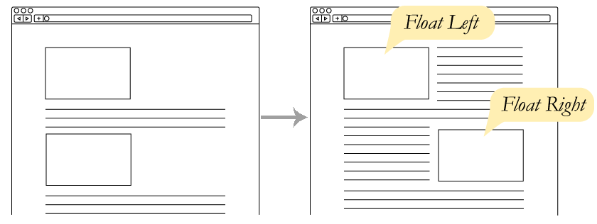
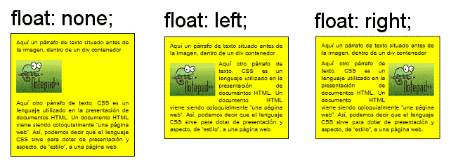
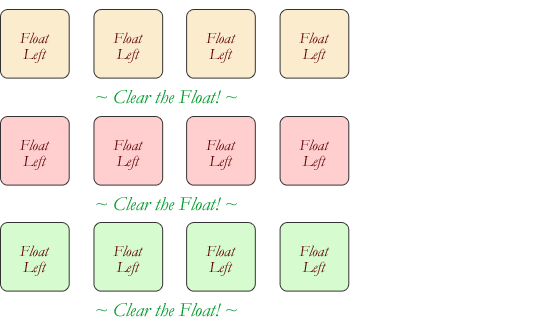
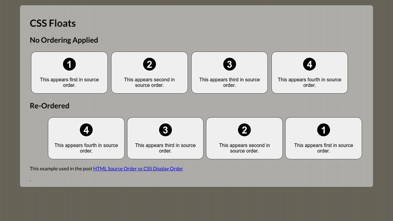
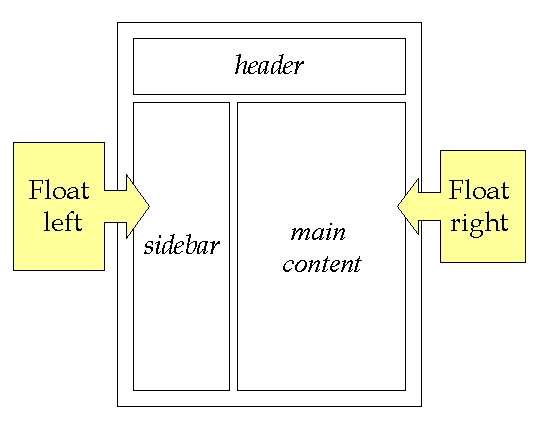

[](readme.md)












## Float
1. **Left (Flutuação para a Esquerda)**:
   ```css
   .element {
       float: left;
   }
   ```
2. **Right (Flutuação para a Direita)**:
   ```css
   .element {
       float: right;
   }
   ```
3. **None (Nenhuma Flutuação)**:
   ```css
   .element {
       float: none;
   }
   ```