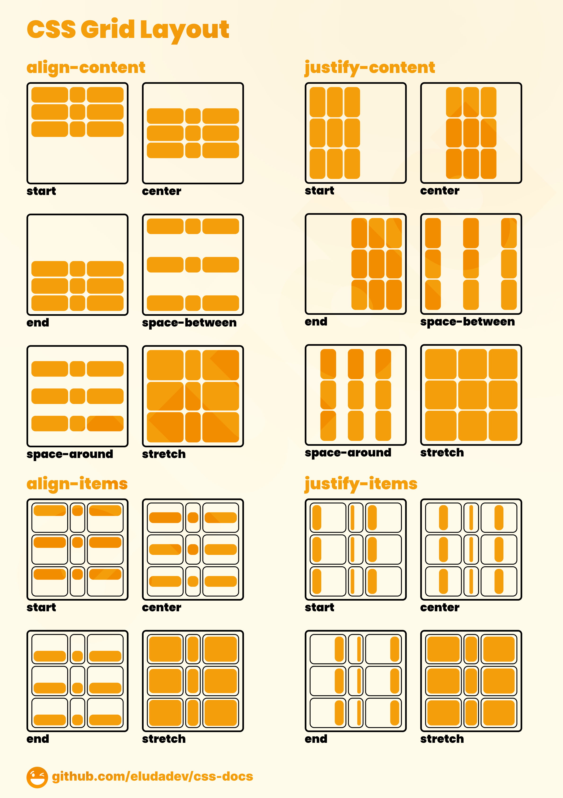
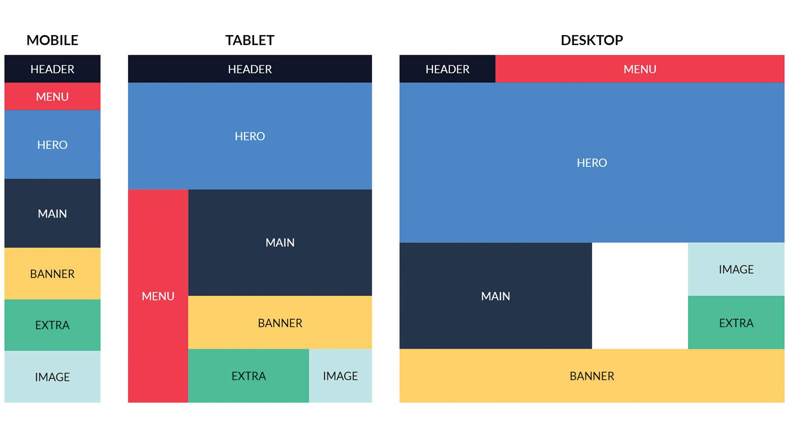
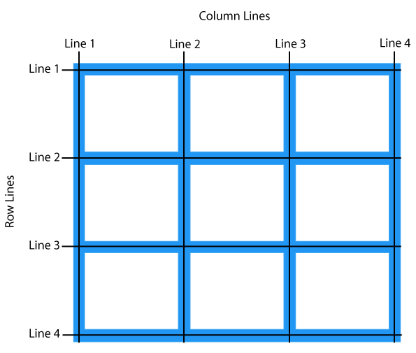

[](readme.md)


### Grid
1. **Container de Grid**:
   ```css
   .container {
       display: grid;
       grid-template-columns: repeat(3, 1fr);
       grid-gap: 10px;
   }
   ```
2. **Item do Grid**:
   ```css
   .item {
       grid-column: span 2;
   }
   ```









